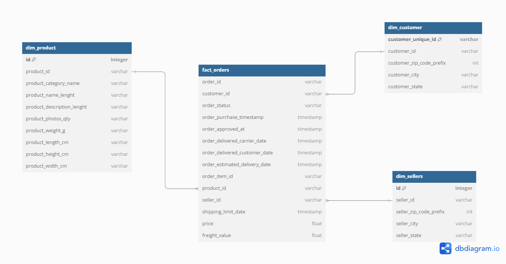
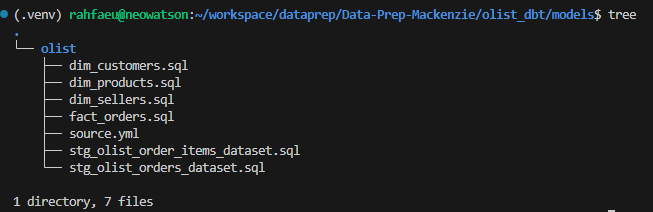

# MBA Engenharia de Dados - Mackenzie


### Integrantes:
| Nome                           |
|--------------------------------|
| Neoaquison Conceição Medeiros  |
| Rafael Medeiros dos Santos     |
| Samuel Silva Perumalswamy      |
| Gustavo Bido                   |

### 1 - Preparar o ambiente de execução
Clonar o repositório do projeto
``` bash
git clone https://github.com/rahfaeu/Data-Prep-Mackenzie.git
```

Entrar no diretório do projeto
``` bash
cd Data-Prep-Mackenzie
```

No diretório principal rodar os seguintes comando para criar o ambiente virtual

``` bash
python3 -m venv .venv
```

Para ativar o ambiente virtual, execute

``` bash
source .venv/bin/activate
```

Instale as bibliotecas do arquivo requirements.txt

``` bash
pip install -r requirements.txt
```

### 2 - Extrair dados do kaggle. 
Executar o comando abaixo para extrair as bases do kaggle e salvar local
``` bash
python3 script/get_kaggle_datasources.py 
```

### 3 - Criar o banco de dados 
Executar o comando abaixo para subir a imagem do postgres no docker
``` bash
docker compose up -d
```

### 4 - Inserir dados nas tabelas transacionais
``` bash
python3 script/df_to_database.py
```

### 5 - Modelagem dimensional (Star Schema)

Abaixo temos o diagrama da modelagem dimensional, consideramos o modelo de Ralph Kimball (Star Schema)



### 6 - Criação do fluxo de Transformação

Utilizamos o DBT como ferramenta de trasformação dos dados na camada analítica.

Criamos 6 modelos

- 2 Stagings
    - stg_olist_order_items_dataset
    - stg_olist_orders_dataset
- 3 Dimensões
    - dim_customers
    - dim_products
    - dim_sellers
- 1 Fato
    - fact_orders



Para materializar os modelos através do DBT, basta executar o seguinte comando:

``` bash
dbt run
```

------------------------------------------------------------------------------

# Modelo lógico Star Schema

## Tabela Fato: `fact_orders`

Centraliza as métricas principais para análise:

- `order_id` (PK)
- `customer_id` (FK para `dim_customers`)
- `seller_id` (FK para `dim_sellers`)
- `product_id` (FK para `dim_products`)
- `review_id` (FK para `dim_reviews`)
- `payment_sequential`
- `shipping_limit_date`
- `price`
- `freight_value`
- `payment_type`
- `payment_installments`
- `payment_value`
- `review_score`
- `order_status`
- `order_purchase_timestamp`
- `order_approved_at`
- `order_delivered_carrier_date`
- `order_delivered_customer_date`
- `order_estimated_delivery_date`

---

## Dimensão: `dim_customers`

Descreve os clientes:

- `customer_id` (PK)
- `customer_unique_id`
- `customer_zip_code_prefix`
- `customer_city`
- `customer_state`

---

## Dimensão: `dim_sellers`

Descreve os vendedores:

- `seller_id` (PK)
- `seller_zip_code_prefix`
- `seller_city`
- `seller_state`

---

## Dimensão: `dim_products`

Descreve os produtos:

- `product_id` (PK)
- `product_category_name` (FK para `dim_category_name`)
- `product_name_length`
- `product_description_length`
- `product_photos_qty`
- `product_weight_g`
- `product_length_cm`
- `product_height_cm`
- `product_width_cm`


---------------------------------------

# Criação do Modelo Físico Star Schema

## Tabela Fato: `fact_orders`

```sql
CREATE TABLE fact_orders (
    order_id BIGINT NOT NULL,
    customer_id BIGINT NOT NULL,
    seller_id BIGINT NOT NULL,
    product_id BIGINT NOT NULL,
    review_id BIGINT,
    payment_sequential INT,
    shipping_limit_date TIMESTAMP,
    price DECIMAL(10, 2),
    freight_value DECIMAL(10, 2),
    payment_type VARCHAR(50),
    payment_installments INT,
    payment_value DECIMAL(10, 2),
    review_score INT,
    order_status VARCHAR(50),
    order_purchase_timestamp TIMESTAMP,
    order_approved_at TIMESTAMP,
    order_delivered_carrier_date TIMESTAMP,
    order_delivered_customer_date TIMESTAMP,
    order_estimated_delivery_date TIMESTAMP,
    PRIMARY KEY (order_id),
    FOREIGN KEY (customer_id) REFERENCES dim_customers(customer_id),
    FOREIGN KEY (seller_id) REFERENCES dim_sellers(seller_id),
    FOREIGN KEY (product_id) REFERENCES dim_products(product_id),
    FOREIGN KEY (review_id) REFERENCES dim_reviews(review_id)
);


## Tabela Dimensão: `dim_customers`
CREATE TABLE dim_customers (
    customer_id BIGINT NOT NULL PRIMARY KEY,
    customer_unique_id VARCHAR(255),
    customer_zip_code_prefix INT,
    customer_city VARCHAR(255),
    customer_state VARCHAR(50)
);


## Tabela Dimensão: `dim_sellers`
CREATE TABLE dim_sellers (
    seller_id BIGINT NOT NULL PRIMARY KEY,
    seller_zip_code_prefix INT,
    seller_city VARCHAR(255),
    seller_state VARCHAR(50)
);


## Tabela Dimensão: `dim_products`
CREATE TABLE dim_products (
    product_id BIGINT NOT NULL PRIMARY KEY,
    product_category_name VARCHAR(255),
    product_name_length INT,
    product_description_length INT,
    product_photos_qty INT,
    product_weight_g DECIMAL(10, 2),
    product_length_cm DECIMAL(10, 2),
    product_height_cm DECIMAL(10, 2),
    product_width_cm DECIMAL(10, 2),
    FOREIGN KEY (product_category_name) REFERENCES dim_category_name(product_category_name)
);
